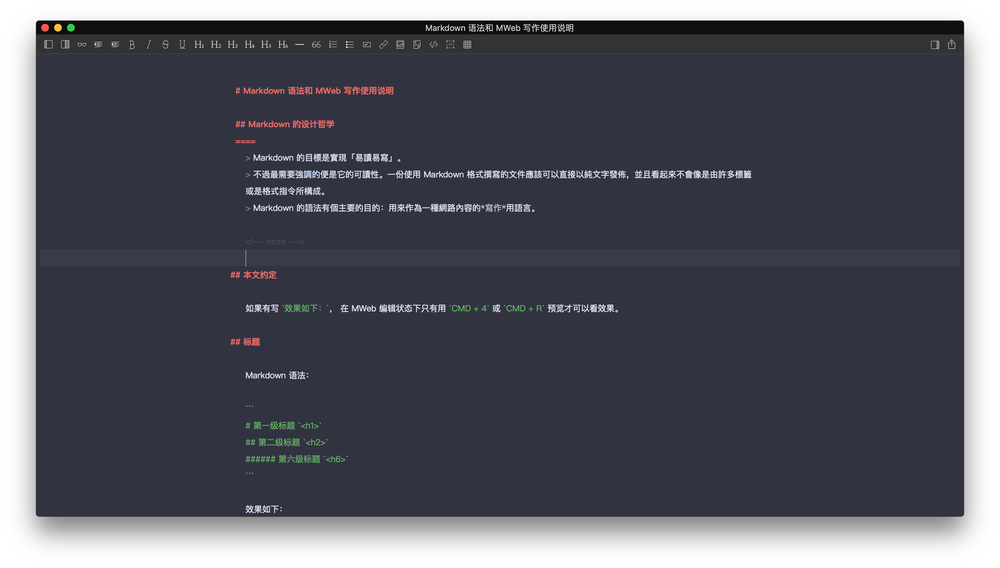
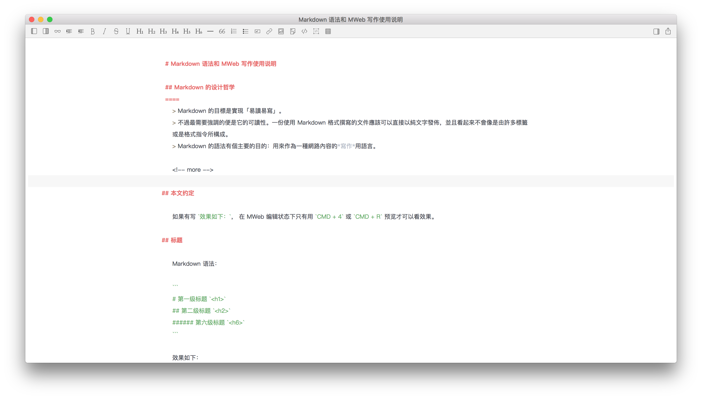

# AtomOne for [MWeb](http://www.mweb.im/)

>A dark theme for [Mweb](http://www.mweb.im/)





## Install

### Install using Git

```
$ git clone https://github.com/ShawnRong/AtomOne-for-MWeb.git
```
### Install manually

[Download ZIP](https://github.com/ShawnRong/AtomOne-for-MWeb/archive/master.zip) then unzip it.

## Activating theme

- Go to `Preferences`->`Themes`->`Editor Light Themes`->`Edit...`
- copy the `atom-one-dark.style` file and `atom-one-light.style` to the `EditorThemes` folder
- `Reload` then select the `atom-one-dark` or the `atom-one-light`
- Use `alt+command+L` to switch over the light theme and dark theme

## License

[MIT License](./LICENSE)

